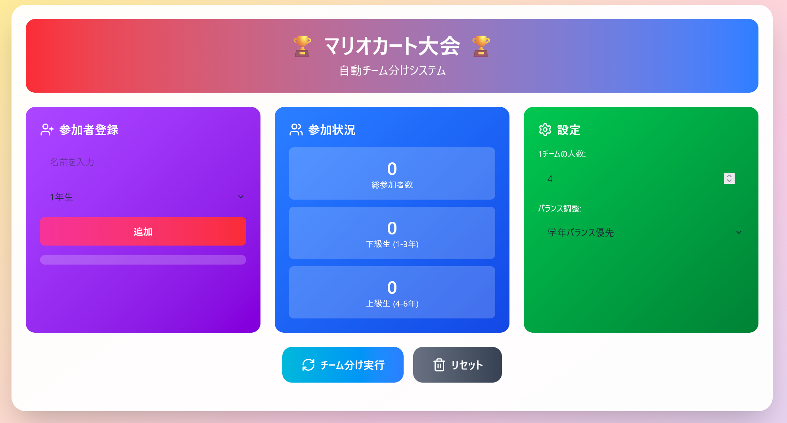

# 🏆 マリオカート大会 自動チーム分けシステム

[](https://github.com/mastermallet/team-building-tool/actions/workflows/deploy.yml)
[](https://www.typescriptlang.org/)
[](https://reactjs.org/)
[](https://opensource.org/licenses/MIT)

小学生向けマリオカート大会のチーム分けを自動化するWebアプリケーションです。最大160人の参加者を学年バランスを考慮しながら、公平なチームに自動分割します。

[🚀 デモを見る](https://mastermallet.github.io/team-building-tool/)



## ✨ 特徴

### 🎯 主要機能

- **自動チーム分け**: 学年バランスを考慮した公平なチーム編成
- **手動調整機能**: チーム分け後に個別メンバーの移動が可能
- **データ永続化**: LocalStorageによる参加者データの自動保存
- **レスポンシブデザイン**: PC・タブレット・スマートフォンに対応
- **リアルタイム統計**: 参加状況を一目で確認

### 🏗️ 技術的特徴

- **クリーンアーキテクチャ**: 保守性・拡張性・テスト容易性を重視した設計
- **TypeScript**: 型安全性による堅牢な実装
- **React + Vite**: 高速な開発体験とビルド
- **Tailwind CSS**: モダンで洗練されたUI
- **GitHub Pages**: 簡単なデプロイと無料ホスティング

## 📋 目次

- [機能詳細](#-機能詳細)
- [技術スタック](#-技術スタック)
- [セットアップ](#-セットアップ)
- [使い方](#-使い方)
- [開発](#-開発)
- [デプロイ](#-デプロイ)
- [プロジェクト構成](#-プロジェクト構成)
- [ライセンス](#-ライセンス)

## 🎮 機能詳細

### 参加者管理

- 名前と学年（1-6年生）を登録
- 最大160人まで登録可能
- リロードしてもデータが保持される（LocalStorage）
- 個別削除・一括リセット機能

### チーム分けアルゴリズム

#### 学年バランス優先モード
- 下級生（1-3年）と上級生（4-6年）の人数差が20%以内の場合
    - 下級生グループと上級生グループに分けて別々に大会を実施
- 人数差が大きい場合
    - AグループとBグループにランダムに分割

#### シンプル分割モード
- 全参加者をランダムにAグループとBグループに分割
- 各グループ内でバランスの取れたチーム編成

### チーム編成の特徴

- 1チームの人数を2-8人で調整可能（デフォルト4人）
- 各チーム内の学年バランスを自動調整
- チーム分け後の手動メンバー移動機能

### メンバー移動機能

1. 「メンバー移動」ボタンをクリック
2. 移動させたいメンバーをクリック（黄色くハイライト）
3. 移動先のチームをクリック
4. メンバーが移動完了

## 🛠 技術スタック

### フロントエンド

- **React 18.2** - UIライブラリ
- **TypeScript 5.2** - 型安全な開発
- **Vite 5.2** - 高速ビルドツール
- **Tailwind CSS 3.4** - ユーティリティファーストCSS
- **Lucide React** - アイコンライブラリ

### 開発ツール

- **ESLint** - コード品質チェック
- **Prettier** - コードフォーマッター
- **pnpm** - 高速パッケージマネージャー
- **GitHub Actions** - CI/CDパイプライン

### アーキテクチャ

```
src/
├── domain/           # ドメイン層（ビジネスロジック）
│   ├── entities/     # エンティティ
│   ├── repositories/ # リポジトリインターフェース
│   └── usecases/     # ユースケース
├── infrastructure/   # インフラ層（外部依存）
│   └── repositories/ # リポジトリ実装
└── presentation/     # プレゼンテーション層（UI）
    ├── components/   # Reactコンポーネント
    └── pages/        # ページコンポーネント
```

## 🚀 セットアップ

### 必要環境

- Node.js 18.0 以上
- pnpm 8.0 以上（推奨）

### インストール

```bash
# リポジトリをクローン
git clone https://github.com/YOUR_USERNAME/mario-kart-team-divider.git
cd mario-kart-team-divider

# pnpmをインストール（未インストールの場合）
npm install -g pnpm

# 依存関係をインストール
pnpm install
```

### 開発サーバー起動

```bash
pnpm dev
```

ブラウザで http://localhost:5173 を開く

## 📖 使い方

### 1. 参加者登録

1. 左側の「参加者登録」セクションで名前を入力
2. 学年を選択（1-6年生）
3. 「追加」ボタンまたはEnterキーで登録

### 2. 設定調整（オプション）

- **1チームの人数**: 2-8人で調整（デフォルト4人）
- **バランス調整**:
    - **学年バランス優先**: 下級生/上級生グループに自動分割
    - **シンプル分割**: A/Bグループにランダム分割

### 3. チーム分け実行

「チーム分け実行」ボタンをクリックすると、自動的にチームが編成されます。

### 4. メンバー移動（オプション）

1. 「メンバー移動」ボタンをクリック
2. 移動させたいメンバーをクリック
3. 移動先のチームをクリック

### 5. データリセット

「リセット」ボタンで全データを削除（確認ダイアログ表示）

## 💻 開発

### 利用可能なコマンド

```bash
# 開発サーバー起動
pnpm dev

# ビルド
pnpm build

# ビルド結果をプレビュー
pnpm preview

# リント実行
pnpm lint

# リント自動修正
pnpm lint:fix

# コードフォーマット
pnpm format

# フォーマットチェック
pnpm format:check

# 型チェック
pnpm type-check
```

### コーディング規約

- **コミット前の自動チェック**: ESLint + Prettier + TypeScript
- **命名規則**:
    - コンポーネント: PascalCase (`ParticipantInput.tsx`)
    - 関数/変数: camelCase (`handleAddParticipant`)
    - 定数: UPPER_SNAKE_CASE (`MAX_PARTICIPANTS`)
- **import順序**: builtin → external → internal → parent → sibling → index

### テスト（今後追加予定）

```bash
# ユニットテスト
pnpm test

# カバレッジ
pnpm test:coverage
```

## 🚢 デプロイ

### GitHub Pagesへのデプロイ

#### 方法1: 自動デプロイ（推奨）

1. GitHubリポジトリにプッシュ
2. GitHub Actionsが自動実行
3. `master`ブランチへのプッシュで自動デプロイ

#### 方法2: 手動デプロイ

```bash
pnpm run deploy
```

### Vercelへのデプロイ

```bash
# Vercel CLIをインストール
npm i -g vercel

# デプロイ
vercel
```

### Netlifyへのデプロイ

```bash
# Netlify CLIをインストール
npm i -g netlify-cli

# デプロイ
netlify deploy --prod
```

## 📂 プロジェクト構成

```
mario-kart-team-divider/
├── .github/
│   └── workflows/
│       └── deploy.yml              # GitHub Actions設定
├── public/                         # 静的ファイル
├── src/
│   ├── domain/                     # ドメイン層
│   │   ├── entities/
│   │   │   ├── Participant.ts     # 参加者エンティティ
│   │   │   └── Team.ts            # チームエンティティ
│   │   ├── repositories/
│   │   │   └── IParticipantRepository.ts
│   │   └── usecases/
│   │       ├── ParticipantUseCase.ts
│   │       └── TeamDivisionUseCase.ts
│   ├── infrastructure/             # インフラ層
│   │   └── repositories/
│   │       └── LocalStorageParticipantRepository.ts
│   ├── presentation/               # プレゼンテーション層
│   │   ├── components/
│   │   │   ├── Header.tsx
│   │   │   ├── ParticipantInput.tsx
│   │   │   ├── Stats.tsx
│   │   │   ├── Settings.tsx
│   │   │   ├── TeamGroup.tsx
│   │   │   └── ControlButtons.tsx
│   │   └── pages/
│   │       └── MarioKartTeamDivider.tsx
│   ├── App.tsx                     # ルートコンポーネント
│   ├── main.tsx                    # エントリーポイント
│   └── index.css                   # グローバルスタイル
├── .eslintrc.cjs                   # ESLint設定
├── .prettierrc                     # Prettier設定
├── .gitignore
├── index.html
├── package.json
├── pnpm-lock.yaml
├── tsconfig.json                   # TypeScript設定
├── vite.config.ts                  # Vite設定
├── tailwind.config.js              # Tailwind CSS設定
└── README.md
```

## 🏗️ アーキテクチャ

### クリーンアーキテクチャの利点

```
┌─────────────────────────────────────────┐
│         Presentation Layer              │
│    (React Components, UI Logic)         │
└──────────────┬──────────────────────────┘
               │ depends on
               ▼
┌─────────────────────────────────────────┐
│           Domain Layer                  │
│  (Business Logic, Entities, Use Cases)  │
└──────────────▲──────────────────────────┘
               │ implements
               │
┌──────────────┴──────────────────────────┐
│       Infrastructure Layer              │
│   (LocalStorage, External APIs)         │
└─────────────────────────────────────────┘
```

#### レイヤー分離のメリット

✅ **テスト容易性**: ビジネスロジックを独立してテスト可能  
✅ **保守性**: 変更の影響範囲を最小化  
✅ **拡張性**: 新機能追加が容易  
✅ **独立性**: UIやDBを変更してもビジネスロジックは不変

## 🤝 コントリビューション

プルリクエストを歓迎します！大きな変更の場合は、まずissueを開いて変更内容を議論してください。

### コントリビューション手順

1. Fork the Project
2. Create your Feature Branch (`git checkout -b feature/AmazingFeature`)
3. Commit your Changes (`git commit -m 'Add some AmazingFeature'`)
4. Push to the Branch (`git push origin feature/AmazingFeature`)
5. Open a Pull Request

## 📝 今後の予定

- [ ] ユニットテスト実装
- [ ] E2Eテスト実装
- [ ] チーム結果のPDF出力機能
- [ ] CSVインポート/エクスポート機能
- [ ] トーナメント表生成機能
- [ ] 多言語対応（英語・日本語）
- [ ] ダークモード対応
- [ ] PWA対応（オフライン動作）

## 📄 ライセンス

このプロジェクトは MIT ライセンスの下でライセンスされています。詳細は [LICENSE](LICENSE) ファイルを参照してください。

## 👤 作者

**Your Name**

- GitHub: [@YOUR_USERNAME](https://github.com/YOUR_USERNAME)
- Twitter: [@YOUR_TWITTER](https://twitter.com/YOUR_TWITTER)

## 🙏 謝辞

- [React](https://reactjs.org/)
- [Vite](https://vitejs.dev/)
- [Tailwind CSS](https://tailwindcss.com/)
- [Lucide Icons](https://lucide.dev/)

---

⭐️ このプロジェクトが役に立ったら、スターをつけてください！